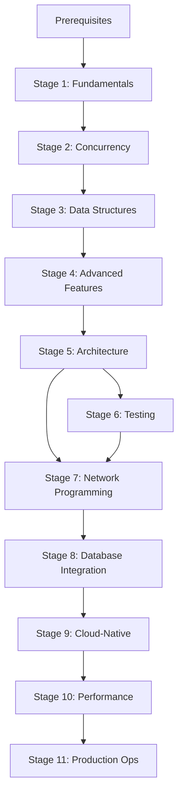

# Applied Go Programming

A comprehensive Go programming learning path built with the Agentic Exercise Curriculum System (AECS) that transforms experienced developers into Go masters through intensive, hands-on Exercises rather than passive learning.

**Learning Through Building**: 11 progressive Stages containing atomic Exercises that take you from Go fundamentals to production systems, each requiring immediate hands-on implementation rather than theoretical study.

**Production Portfolio**: Complete the path with working applications including concurrent web services, data processing pipelines, microservices architectures, cloud-native deployments, and comprehensive monitoring systems.

## Getting Started

### Initialize New Learning Paths

To create a new training plan, run the following in plan mode:

```
Prompt: _framework/prompts/create-path.md
Subject: [whatever you are interested in learning]
Ultrathink.
```

### Execute Framework Prompts

You will get the best results by executing the prompts in the following format in plan mode:

```
Prompt: [path-to-prompt]
Parameter: [value]
Follow all directives from CLAUDE.md. Ultrathink.
```

Example:

```
Prompt: _framework/prompts/create-exercise.md
Exercise: 1.2.
Follow all directives from CLAUDE.md. Ultrathink.
```

### Start Learning Go

1. **Begin with Fundamentals**: Start with `stages/01-fundamentals/` and complete each Exercise by building working Go code
2. **Progress Through Dependencies**: Each Stage builds on previously mastered concepts - complete Stages sequentially
3. **Validate Through Implementation**: Every Exercise must produce working code that compiles, runs, and demonstrates the target concept

## Prerequisites

**Programming Experience**: Proficiency in at least one language (Java, Python, C#, JavaScript, etc.) with understanding of fundamental concepts through hands-on implementation.

**Technical Setup**: Go 1.24+, code editor with Go support, Docker for deployment exercises, and basic command-line familiarity.

**Learning Commitment**: 12-16 weeks self-paced with focus on building working applications rather than consuming theoretical content.

## Path Metadata

- **Subject**: Go Programming
- **Target Audience**: Experienced developers familiar with other programming languages
- **Difficulty Progression**: Fundamentals to Production Mastery
- **Total Estimated Duration**: 12-16 weeks self-paced
- **Last Updated**: 2025-07-29

## Exercise-Driven Learning Path

This comprehensive Path transforms experienced developers into Go masters through intensive, practical Exercises. Rather than theoretical lectures, you'll build real-world applications, solve production challenges, and master Go's unique approach to software development through hands-on implementation. Each Stage centers on atomic Exercises that progressively build your expertise from Go fundamentals to production-ready systems.

You'll emerge with deep understanding of Go's concurrency model, proficiency in Go's standard library, experience building scalable applications, and the confidence to architect production Go systems. This Path emphasizes learning through doing - every Concept is reinforced through practical application that produces tangible results.

## Practical Mastery Objectives

By completing this Path through hands-on Exercise implementation, you will have built:

- [ ] Complete Go applications demonstrating fundamental language constructs and idioms
- [ ] High-performance concurrent applications using goroutines, channels, and synchronization primitives
- [ ] Sophisticated data structures optimized for Go's memory model with benchmark validation
- [ ] Maintainable Go applications using proven architectural patterns and dependency injection
- [ ] Comprehensive test suites using Go's testing framework with coverage analysis
- [ ] Robust network services from TCP/UDP fundamentals to HTTP/gRPC applications
- [ ] Efficient database-integrated applications with connection pooling and transaction management
- [ ] Cloud-native applications with container orchestration and Kubernetes integration
- [ ] Performance-optimized applications with profiling, tuning, and runtime analysis
- [ ] Production-ready applications with comprehensive observability, monitoring, and debugging
- [ ] Secure applications implementing authentication, authorization, and cryptographic operations
- [ ] Integrated Go applications within modern cloud infrastructure and microservices architectures

## Stage Progression

### Stage 1: Fundamentals

**Exercise Focus**: Master core Go language constructs through atomic, hands-on implementation

**Concepts Mastered Through Building**:
- Go installation and environment setup through practical configuration
- Basic program structure and compilation through working examples
- Variables, types, and declarations through implementation exercises
- Functions and methods through step-by-step construction
- Control structures (if/else, loops, switch) through building applications
- Slices and arrays through data manipulation exercises
- Maps and key-value operations through practical implementations
- Pointers and memory management through working examples
- Structs and custom types through data modeling exercises
- Interfaces and contracts through implementation exercises
- Basic error handling patterns through practical examples
- Package organization and modules through project construction

**Prerequisites**: Programming experience in another language
**Estimated Duration**: 2 weeks
**Practical Outcomes**: Working Go programs demonstrating each fundamental concept

---

### Stage 2: Concurrency

**Exercise Focus**: Build concurrent applications using Go's concurrency primitives

**Concepts Mastered Through Building**:
- Goroutine creation and management through practical implementations
- Channel operations and communication patterns through working examples
- Context package usage for cancellation and deadlines through applications
- Sync package primitives through hands-on synchronization exercises
- Worker pools and pipeline patterns through complete implementations
- Race condition detection and prevention through practical debugging

**Prerequisites**: Stage 1 fundamentals mastered through practical implementation
**Estimated Duration**: 2-3 weeks
**Practical Outcomes**: Concurrent applications handling real workloads

---

### Stage 3: Data Structures and Algorithms

**Exercise Focus**: Implement efficient data structures and algorithms using Go idioms

**Concepts Mastered Through Building**:
- Custom data structures with optimal memory layout through implementation
- Algorithm implementations following Go conventions through coding exercises
- Benchmark-driven optimization through performance measurement
- Memory management and garbage collector interaction through practical analysis
- Interface-based design for flexible algorithms through working implementations

**Prerequisites**: Stages 1-2 mastered through hands-on implementation
**Estimated Duration**: 2 weeks
**Practical Outcomes**: Optimized data structures with performance benchmarks

---

### Stage 4: Advanced Language Features

**Exercise Focus**: Build applications using sophisticated Go language constructs

**Concepts Mastered Through Building**:
- Interface composition and embedding through practical implementations
- Reflection and code generation through working applications
- Generic programming with type parameters through hands-on exercises
- Advanced error handling strategies through implementation patterns
- Package design and module management through project construction
- Build constraints and conditional compilation through practical examples

**Prerequisites**: Stages 1-3 mastered through practical building
**Estimated Duration**: 1-2 weeks
**Practical Outcomes**: Advanced Go applications using sophisticated language features

---

### Stage 5: Application Architecture

**Exercise Focus**: Design and implement maintainable Go applications using proven patterns

**Concepts Mastered Through Building**:
- Clean architecture implementation through hands-on application construction
- Dependency injection patterns through practical implementations
- Domain-driven design through working application examples
- Microservices communication through hands-on integration exercises
- Configuration management through practical implementation
- Structured logging and observability through working monitoring systems

**Prerequisites**: Stages 1-4 mastered through practical implementation
**Estimated Duration**: 2-3 weeks
**Practical Outcomes**: Well-architected Go applications with proper separation of concerns

---

### Stage 6: Testing Excellence

**Exercise Focus**: Build comprehensive test suites ensuring code reliability

**Concepts Mastered Through Building**:
- Unit testing with table-driven tests through hands-on implementation
- Integration testing strategies through working test environments
- Mock generation and dependency testing through practical exercises
- Property-based and fuzz testing through implementation examples
- Benchmark testing and performance validation through measurement exercises
- Test coverage analysis through practical quality assessment

**Prerequisites**: Stages 1-5 mastered through hands-on building
**Estimated Duration**: 1-2 weeks
**Practical Outcomes**: Thoroughly tested applications with comprehensive coverage

---

### Stage 7: Network Programming

**Exercise Focus**: Build sophisticated network applications and distributed systems

**Concepts Mastered Through Building**:
- TCP/UDP programming through hands-on protocol implementation
- HTTP server implementation through working web service construction
- WebSocket and real-time communication through practical applications
- gRPC services and Protocol Buffers through implementation exercises
- Connection pooling and resource management through performance optimization
- Load balancing and service discovery through distributed system building

**Prerequisites**: Stages 1-6 mastered through practical implementation
**Estimated Duration**: 2-3 weeks
**Practical Outcomes**: Network applications handling concurrent connections

---

### Stage 8: Database Integration

**Exercise Focus**: Implement robust database interactions with performance optimization

**Concepts Mastered Through Building**:
- SQL database integration through hands-on connection implementation
- Connection pooling and transaction management through practical exercises
- ORM patterns and query builders through working data access layers
- NoSQL database integration through implementation examples
- Migration strategies through hands-on schema management
- Database testing through practical fixture implementation

**Prerequisites**: Stages 1-7 mastered through hands-on building
**Estimated Duration**: 2 weeks
**Practical Outcomes**: Data-driven applications with efficient database integration

---

### Stage 9: Cloud-Native Development

**Exercise Focus**: Build cloud-native applications with modern deployment patterns

**Concepts Mastered Through Building**:
- Docker containerization through hands-on multi-stage builds
- Kubernetes operators through custom controller implementation
- Service mesh integration through practical traffic management
- Configuration and secret management through implementation exercises
- Health checks and readiness probes through working monitoring systems
- Horizontal scaling through hands-on resource management

**Prerequisites**: Stages 1-8 mastered through practical implementation
**Estimated Duration**: 2-3 weeks
**Practical Outcomes**: Cloud-native applications deployed to production environments

---

### Stage 10: Performance Engineering

**Exercise Focus**: Profile, optimize, and tune Go applications for production performance

**Concepts Mastered Through Building**:
- CPU and memory profiling through hands-on analysis implementation
- Garbage collector tuning through practical optimization exercises
- Benchmark-driven optimization through measurement and improvement cycles
- Memory layout optimization through implementation restructuring
- Concurrency performance patterns through hands-on optimization
- Production performance monitoring through working observability systems

**Prerequisites**: Stages 1-9 mastered through hands-on building
**Estimated Duration**: 1-2 weeks
**Practical Outcomes**: High-performance applications optimized for production workloads

---

### Stage 11: Production Operations

**Exercise Focus**: Implement comprehensive observability and production readiness

**Concepts Mastered Through Building**:
- Structured logging and log aggregation through hands-on implementation
- Metrics collection and monitoring through working observability systems
- Distributed tracing through practical implementation exercises
- Error tracking and alerting through hands-on monitoring construction
- Production debugging through practical troubleshooting exercises
- Incident response through hands-on operational procedures

**Prerequisites**: Stages 1-10 mastered through practical implementation
**Estimated Duration**: 1-2 weeks
**Practical Outcomes**: Production-ready applications with comprehensive operational support

---

## Progressive Complexity Map



## Implementation Verification

### Path Completion Criteria

Your Path mastery is demonstrated through:

- [ ] Successfully implementing all Stage Exercises with working, compilable code
- [ ] Building at least 3 substantial portfolio applications demonstrating integrated skills
- [ ] Creating applications that handle real-world performance requirements (1000+ concurrent users)
- [ ] Implementing comprehensive test suites with measurable coverage metrics
- [ ] Deploying applications to production environments with proper observability
- [ ] Demonstrating security best practices through practical implementation

### Portfolio of Built Solutions

Upon Path completion, you will have implemented:

- **Concurrent Web Service**: High-performance HTTP service with goroutine-based request handling
- **Data Processing Pipeline**: Stream processing application with efficient data structures and algorithms
- **Microservices Architecture**: Distributed system with service discovery and inter-service communication
- **Cloud-Native Application**: Containerized service deployed with Kubernetes orchestration
- **Production Monitoring System**: Complete observability stack with metrics, logging, and tracing

## Essential Building Tools

- **Go Toolchain**: Official Go compiler, formatter, and development tools - Required for all practical implementation
- **Docker**: Container runtime for building and deploying Go applications
- **Kubernetes**: Container orchestration platform for cloud-native development exercises
- **PostgreSQL/MySQL**: Relational databases for data persistence implementation exercises
- **Redis**: In-memory data store for caching and session management exercises
- **Prometheus/Grafana**: Monitoring and observability stack for production implementation exercises

## Supporting Resources

### Implementation References
- [Effective Go](https://golang.org/doc/effective_go.html) - Official Go programming guidelines for practical implementation
- [Go Memory Model](https://golang.org/ref/mem) - Understanding Go's concurrency guarantees for hands-on development
- [Go Standard Library Documentation](https://pkg.go.dev/std) - Comprehensive reference for practical implementation

### Community Support
- **Go Community Slack**: Real-time discussion and implementation support - [https://gophers.slack.com](https://gophers.slack.com)
- **Reddit r/golang**: Community discussions and project sharing for practical feedback - [https://reddit.com/r/golang](https://reddit.com/r/golang)
- **Stack Overflow**: Technical Q&A with active Go community for implementation questions - [https://stackoverflow.com/questions/tagged/go](https://stackoverflow.com/questions/tagged/go)

## AECS Framework

This Path implements the **Agentic Exercise Curriculum System** (AECS), a methodology for mastering technical subjects through Exercise-driven learning rather than passive consumption.

**Core AECS Principles**:
- **Exercise Primacy**: Every learning interaction centers on building working code, never passive reading
- **Concept Atomicity**: Each Exercise demonstrates exactly one Go concept in its simplest useful form
- **Applied Understanding**: Learning occurs through practical implementation producing tangible results
- **Progressive Complexity**: Each concept builds incrementally on previously mastered dependencies

**Framework Structure**: The complete AECS methodology and reusable templates are contained in `_framework/` for creating similar Exercise-driven learning experiences in other technical domains.

---

**Path Metadata**
- **Created**: 2025-07-29
- **AECS Compliance**: Verified for Exercise Primacy, Concept Atomicity, Applied Understanding, and Progressive Complexity
- **Hierarchy**: Subject→Path→Stage→Exercise→Concept