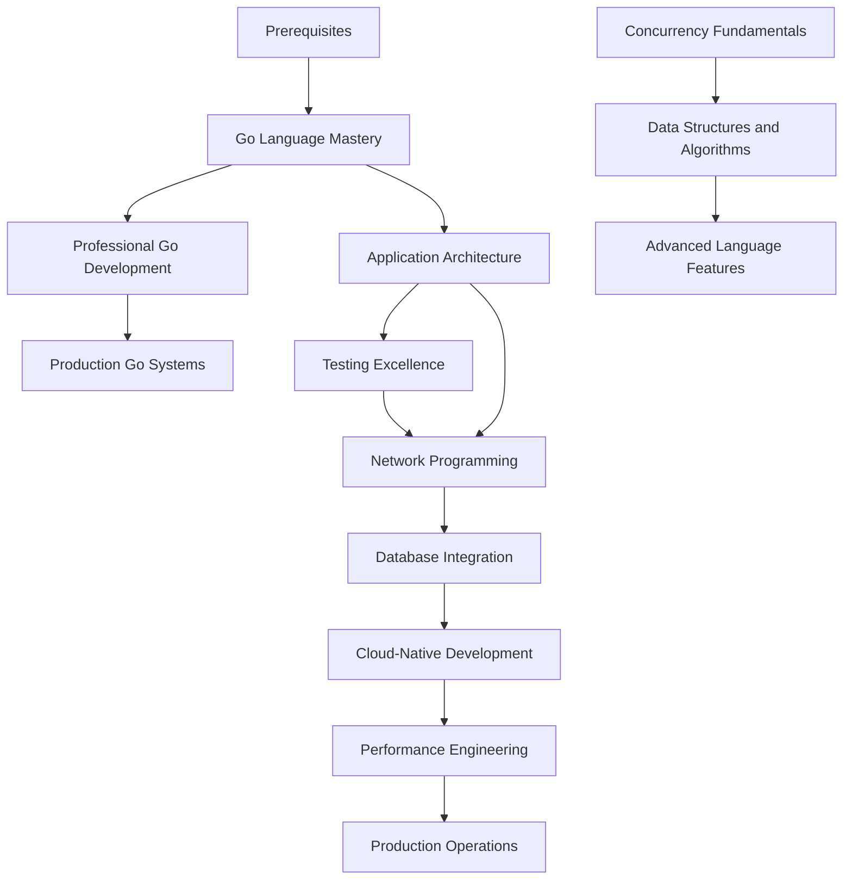

# Applied Go Programming: An Exercise-Driven Journey

## Course Metadata

- **Target Audience**: Experienced developers familiar with other programming languages
- **Difficulty Level**: Intermediate to Advanced
- **Total Duration**: 12-16 weeks self-paced
- **Format**: Exercise-driven with hands-on projects
- **Last Updated**: 2025-07-28

## Course Overview

This comprehensive curriculum transforms experienced developers into Go masters through intensive, practical exercises. Rather than theoretical lectures, you'll build real-world applications, solve production challenges, and master Go's unique approach to software development. Each chapter centers on hands-on exercises that progressively build your expertise from Go fundamentals to production-ready systems.

You'll emerge with deep understanding of Go's concurrency model, proficiency in Go's standard library, experience building scalable applications, and the confidence to architect production Go systems. This curriculum emphasizes learning through doing - every concept is reinforced through practical application.

## Learning Objectives

By completing this curriculum, you will:

- [ ] Master Go's concurrency primitives and build high-performance concurrent applications
- [ ] Implement sophisticated data structures optimized for Go's memory model
- [ ] Design and build maintainable Go applications using proven architectural patterns
- [ ] Write comprehensive test suites using Go's testing framework and advanced testing techniques
- [ ] Build robust network services from TCP/UDP fundamentals to HTTP/gRPC applications
- [ ] Implement efficient database interactions with connection pooling and transaction management
- [ ] Create cloud-native applications with container orchestration and Kubernetes integration
- [ ] Profile, optimize, and tune Go applications for production performance
- [ ] Implement comprehensive observability, monitoring, and debugging strategies
- [ ] Apply security best practices for authentication, authorization, and cryptographic operations
- [ ] Debug and troubleshoot complex production issues in Go applications
- [ ] Integrate Go applications with modern cloud infrastructure and microservices architectures

## Prerequisites

**Required Knowledge:**
- Proficiency in at least one programming language (Java, Python, C#, JavaScript, etc.)
- Understanding of fundamental programming concepts (variables, functions, control structures)
- Basic command-line familiarity
- Understanding of HTTP protocols and web development concepts

**Technical Requirements:**
- Go 1.24+ installed and configured
- Code editor with Go support (VS Code, GoLand, or Vim with Go plugins)
- Docker and container runtime environment
- Access to cloud platform (AWS, GCP, or Azure) for advanced exercises
- Basic familiarity with Git version control

## Course Structure

### Part I: Go Language Mastery

**Chapter 1: Concurrency Fundamentals**

Master Go's signature feature through practical exercises building concurrent applications. You'll implement worker pools, pipeline patterns, and synchronization mechanisms while understanding Go's approach to concurrent programming.

**Key Topics:**
- Goroutines and runtime scheduler behavior
- Channel operations and communication patterns
- Context package for cancellation and deadlines
- Sync package primitives and their appropriate usage
- Common concurrency patterns and anti-patterns
- Race condition detection and prevention

**Estimated Duration:** 2-3 weeks

---

**Chapter 2: Data Structures and Algorithms**

Implement efficient data structures leveraging Go's memory model and type system. Focus on practical algorithms commonly needed in production Go applications.

**Key Topics:**
- Slices, maps, and their performance characteristics
- Custom data structures with optimal memory layout
- Algorithm implementation with Go idioms
- Benchmark-driven optimization techniques
- Memory management and garbage collector interaction
- Interface-based design for flexible algorithms

**Estimated Duration:** 2 weeks

---

**Chapter 3: Advanced Language Features**

Deep dive into Go's sophisticated language constructs through complex real-world scenarios requiring advanced Go techniques.

**Key Topics:**
- Interface composition and embedding patterns
- Reflection and code generation techniques
- Generic programming with type parameters
- Error handling strategies and custom error types
- Package design and module management
- Build constraints and conditional compilation

**Estimated Duration:** 1-2 weeks

---

### Part II: Professional Go Development

**Chapter 4: Application Architecture Patterns**

Design and implement maintainable Go applications using proven architectural patterns. Build applications that scale from prototypes to production systems.

**Key Topics:**
- Clean architecture and dependency injection
- Domain-driven design with Go idioms
- Microservices communication patterns
- Configuration management and environment handling
- Logging, tracing, and structured observability
- Graceful shutdown and lifecycle management

**Estimated Duration:** 2-3 weeks

---

**Chapter 5: Testing Excellence**

Master Go's testing ecosystem through comprehensive test suite development. Learn advanced testing patterns that ensure code reliability and maintainability.

**Key Topics:**
- Unit testing with table-driven tests
- Integration testing strategies and test environments
- Mock generation and dependency testing
- Property-based and fuzz testing
- Benchmark testing and performance validation
- Test coverage analysis and quality metrics

**Estimated Duration:** 1-2 weeks

---

**Chapter 6: Network Programming Mastery**

Build sophisticated network applications from low-level protocols to high-performance web services. Master Go's networking capabilities for distributed systems.

**Key Topics:**
- TCP/UDP programming with net package
- HTTP server implementation and middleware patterns
- WebSocket and real-time communication
- gRPC services and Protocol Buffers
- Connection pooling and resource management
- Load balancing and service discovery

**Estimated Duration:** 2-3 weeks

---

### Part III: Production Go Systems

**Chapter 7: Database Integration Patterns**

Implement robust database interactions with connection management, transaction handling, and performance optimization for production workloads.

**Key Topics:**
- SQL database integration with database/sql
- Connection pooling and transaction management
- ORM patterns and query builders
- NoSQL database integration (MongoDB, Redis)
- Migration strategies and schema management
- Database testing and fixture management

**Estimated Duration:** 2 weeks

---

**Chapter 8: Cloud-Native Development**

Build cloud-native applications with container orchestration, Kubernetes integration, and modern deployment patterns.

**Key Topics:**
- Docker containerization and multi-stage builds
- Kubernetes operators and custom controllers
- Service mesh integration and traffic management
- Configuration and secret management
- Health checks and readiness probes
- Horizontal scaling and resource management

**Estimated Duration:** 2-3 weeks

---

**Chapter 9: Performance Engineering**

Profile, optimize, and tune Go applications for production performance. Master Go's runtime characteristics and optimization techniques.

**Key Topics:**
- CPU and memory profiling with pprof
- Garbage collector tuning and analysis
- Benchmark-driven optimization workflows
- Memory layout optimization techniques
- Concurrency performance patterns
- Production performance monitoring

**Estimated Duration:** 1-2 weeks

---

**Chapter 10: Production Operations**

Implement comprehensive observability, monitoring, and debugging strategies for production Go applications.

**Key Topics:**
- Structured logging and log aggregation
- Metrics collection and monitoring systems
- Distributed tracing implementation
- Error tracking and alerting systems
- Production debugging techniques
- Incident response and postmortem analysis

**Estimated Duration:** 1-2 weeks

---

## Learning Path

## Assessment Strategy

### Progress Tracking
- [ ] **Chapter Completion**: Complete all exercises in each chapter with working code
- [ ] **Mastery Checkpoints**: Build comprehensive projects every 3-4 chapters demonstrating integrated skills
- [ ] **Portfolio Projects**: Create production-ready applications showcasing advanced Go techniques

### Success Criteria
- **Code Competency**: Successfully implement all chapter exercises with proper error handling and testing - code must compile without errors and pass all provided test cases
- **Portfolio Projects**: Build at least 3 substantial portfolio projects demonstrating real-world Go application development with measurable performance benchmarks (1000+ concurrent users)
- **Concurrency Mastery**: Demonstrate proficiency in Go concurrency patterns through complex multi-goroutine applications that properly handle race conditions and graceful shutdown
- **Production Readiness**: Create production-ready applications with proper observability, testing, and deployment strategies including structured logging and metrics collection
- **Performance Optimization**: Show mastery of Go performance optimization through benchmark-driven development with documented performance improvements
- **Security Implementation**: Implement secure Go applications following industry best practices with proper input validation and authentication

## Resources

### Essential Tools
- **Go Toolchain**: Official Go compiler, formatter, and development tools
- **Docker**: Container runtime for building and deploying Go applications
- **Kubernetes**: Container orchestration for cloud-native development exercises
- **PostgreSQL/MySQL**: Relational database for data persistence exercises
- **Redis**: In-memory data store for caching and session management
- **Prometheus/Grafana**: Monitoring and observability stack for production exercises

### Recommended Reading
- [Effective Go](https://golang.org/doc/effective_go.html) - Official Go programming guidelines
- [Go Memory Model](https://golang.org/ref/mem) - Understanding Go's concurrency guarantees
- [Go Standard Library Documentation](https://pkg.go.dev/std) - Comprehensive standard library reference
- [Go Blog](https://blog.golang.org/) - Official insights and best practices from the Go team
- [GopherCon Talks](https://www.youtube.com/c/GopherAcademy) - Conference presentations on advanced Go topics

### Community & Support
- **Go Community Slack**: Real-time discussion and support - [https://gophers.slack.com](https://gophers.slack.com)
- **Reddit r/golang**: Community discussions and project sharing - [https://reddit.com/r/golang](https://reddit.com/r/golang)
- **Go Forum**: Official community forum for Go discussions - [https://forum.golangbridge.org](https://forum.golangbridge.org)
- **Stack Overflow**: Technical Q&A with active Go community - [https://stackoverflow.com/questions/tagged/go](https://stackoverflow.com/questions/tagged/go)

---

*This curriculum follows the Agentic Exercise Curriculum System (AECS) methodology, ensuring consistent quality and pedagogical effectiveness through AI agent collaboration.*