# Fundamentals: Exercise Progression

## Stage Metadata

- **Stage Number**: 1
- **Difficulty Level**: Beginner
- **Total Exercises**: 12
- **Estimated Duration**: 2 weeks
- **Prerequisites**: Programming experience in another language

## Exercise Sequence

This Stage contains the following Exercise progression for related Concepts:

### 1. Exercise: Basic Program Structure and Compilation

**Practical Implementation**: Build a "Hello World" program demonstrating Go's basic program structure and compilation process

**Prerequisites**: Go installation and basic command-line familiarity
**Estimated Time**: 30 minutes
**Tangible Result**: Working Go program that compiles and executes, outputting Go version string, build information, and runtime architecture

**Building Task**: Create a program using package main, import statements, and main function that produces verifiable system output

---

### 2. Exercise: Variables and Type Declarations

**Practical Implementation**: Build a data collection program using all Go variable declaration patterns and type conversions

**Prerequisites**: Basic program structure mastered
**Estimated Time**: 1 hour
**Tangible Result**: Program that declares, assigns, and converts between different data types with visible type information output

**Building Task**: Create a program that processes different data types and demonstrates type reflection or explicit type assertions

---

### 3. Exercise: Basic Functions

**Practical Implementation**: Build a simple calculator using basic function definitions and calls

**Prerequisites**: Variables and types mastered
**Estimated Time**: 1 hour
**Tangible Result**: Calculator program that performs arithmetic operations using well-defined functions

**Building Task**: Create functions for basic arithmetic operations with single parameters and return values

---

### 4. Exercise: Advanced Function Features

**Practical Implementation**: Build an enhanced calculator using multiple parameters, return values, and named returns

**Prerequisites**: Basic functions mastered
**Estimated Time**: 1.5 hours
**Tangible Result**: Calculator with complex operations demonstrating multiple return values and named returns

**Building Task**: Create functions with multiple parameters, multiple return values, and named return patterns

---

### 5. Exercise: Conditional Logic

**Practical Implementation**: Build a decision-making program using if/else statements and boolean logic

**Prerequisites**: Advanced function features mastered
**Estimated Time**: 45 minutes
**Tangible Result**: Program that makes decisions based on input conditions with clear branching logic

**Building Task**: Create a program using if/else statements for input validation and conditional processing

---

### 6. Exercise: Iteration and Loops

**Practical Implementation**: Build a text processor using for loops for repetitive operations

**Prerequisites**: Conditional logic mastered
**Estimated Time**: 1 hour
**Tangible Result**: Text processor that iterates through data collections using various loop patterns

**Building Task**: Create a program using for loops to process collections of string data with iteration patterns

---

### 7. Exercise: Arrays for Fixed Collections

**Practical Implementation**: Build a grade storage system using fixed-size arrays

**Prerequisites**: Iteration and loops mastered
**Estimated Time**: 1 hour
**Tangible Result**: Grade management program using arrays for storing and accessing fixed collections of numerical data

**Building Task**: Create a program using arrays to store, access, and process fixed-size collections of student grades

---

### 8. Exercise: Slices for Dynamic Collections

**Practical Implementation**: Build a dynamic data management system using slices for growing collections

**Prerequisites**: Arrays for fixed collections mastered
**Estimated Time**: 1.5 hours
**Tangible Result**: Data processor demonstrating append, slice, and copy operations on dynamic collections

**Building Task**: Create a program using slices for dynamic data manipulation, growing and shrinking collections as needed

---

### 9. Exercise: Maps and Key-Value Operations

**Practical Implementation**: Build a word frequency counter using maps for data storage and retrieval

**Prerequisites**: Slices for dynamic collections mastered
**Estimated Time**: 1.5 hours
**Tangible Result**: Text analysis tool that counts word occurrences and generates frequency reports using map operations

**Building Task**: Create a program using maps to store and retrieve key-value pairs for word frequency analysis

---

### 10. Exercise: Pointer Syntax and Value Modification

**Practical Implementation**: Build a data modification system using pointers to change values in place

**Prerequisites**: Maps and key-value operations mastered
**Estimated Time**: 1.5 hours
**Tangible Result**: Program that displays memory addresses and modifies data through pointer operations

**Building Task**: Create a program using pointer syntax to modify values in place and demonstrate address operations

---

### 11. Exercise: Struct Data Modeling

**Practical Implementation**: Build a contact storage system using custom struct types for data organization

**Prerequisites**: Pointer syntax and value modification mastered
**Estimated Time**: 1.5 hours
**Tangible Result**: Contact database that stores and organizes personal information using structured data types

**Building Task**: Create a program with struct definitions and constructor functions for organizing related data

---

### 12. Exercise: Interface Contracts and Structural Typing

**Practical Implementation**: Build a shape calculation system using interfaces to define common behavior patterns

**Prerequisites**: Struct data modeling mastered
**Estimated Time**: 2 hours
**Tangible Result**: Geometry calculator demonstrating Go's structural typing and interface satisfaction

**Building Task**: Create a system with interface definitions and multiple types that satisfy the interface contracts

---

## Progressive Complexity Validation

### Dependency Chain

```mermaid
graph LR
    Prerequisites --> Ex1[Program Structure]
    Ex1 --> Ex2[Variables & Types]
    Ex2 --> Ex3[Basic Functions]
    Ex3 --> Ex4[Advanced Functions]
    Ex4 --> Ex5[Conditional Logic]
    Ex5 --> Ex6[Iteration & Loops]
    Ex6 --> Ex7[Arrays]
    Ex7 --> Ex8[Slices]
    Ex8 --> Ex9[Maps]
    Ex9 --> Ex10[Pointers]
    Ex10 --> Ex11[Structs]
    Ex11 --> Ex12[Interfaces]
```

### Concept Mastery Progression

After completing all Exercises in this Stage, you will have mastered:

- [ ] Basic program structure and compilation (through hands-on implementation)
- [ ] Variable declarations and type system (through hands-on implementation)
- [ ] Basic function definition and calls (through hands-on implementation)
- [ ] Advanced function features with multiple returns (through hands-on implementation)
- [ ] Conditional logic with if/else statements (through hands-on implementation)
- [ ] Iteration patterns with for loops (through hands-on implementation)
- [ ] Fixed-size collections with arrays (through hands-on implementation)
- [ ] Dynamic collections with slices (through hands-on implementation)
- [ ] Key-value data handling with maps (through hands-on implementation)
- [ ] Pointer syntax and value modification (through hands-on implementation)
- [ ] Struct definitions for data modeling (through hands-on implementation)
- [ ] Interface contracts and structural typing (through hands-on implementation)

## Implementation Verification

### Practical Validation

To verify Stage completion, your implementations should:

- [ ] Compile successfully using `go build` without errors or warnings
- [ ] Execute and produce expected output demonstrating each concept
- [ ] Handle edge cases and invalid input appropriately
- [ ] Follow Go naming conventions and idiomatic patterns
- [ ] Include proper error handling where applicable
- [ ] Demonstrate memory-safe operations with pointers
- [ ] Show understanding of Go's type system through practical usage
- [ ] Organize code into logical, reusable components

### Next Stage Preparation

**Progressive Complexity**: Completing this Stage's Exercises (which demonstrate mastered Concepts) enables these Concepts to be demonstrated in the next Stage:

- **Goroutine Creation**: Basic and advanced function concepts enable concurrent execution patterns
- **Channel Communication**: Knowledge of types and interfaces enables message passing between goroutines
- **Context Usage**: Conditional logic and error handling patterns enable cancellation and timeout management
- **Synchronization Primitives**: Pointer knowledge enables safe concurrent data access

**Next Stage**: Stage 2: Concurrency

---

**Stage Metadata**
- **Created**: 2025-07-29
- **AECS Compliance**: Verified for Exercise Primacy, Concept Atomicity, Applied Understanding, and Progressive Complexity
- **Hierarchy**: Subject→Path→Stage→Concept→Exercise